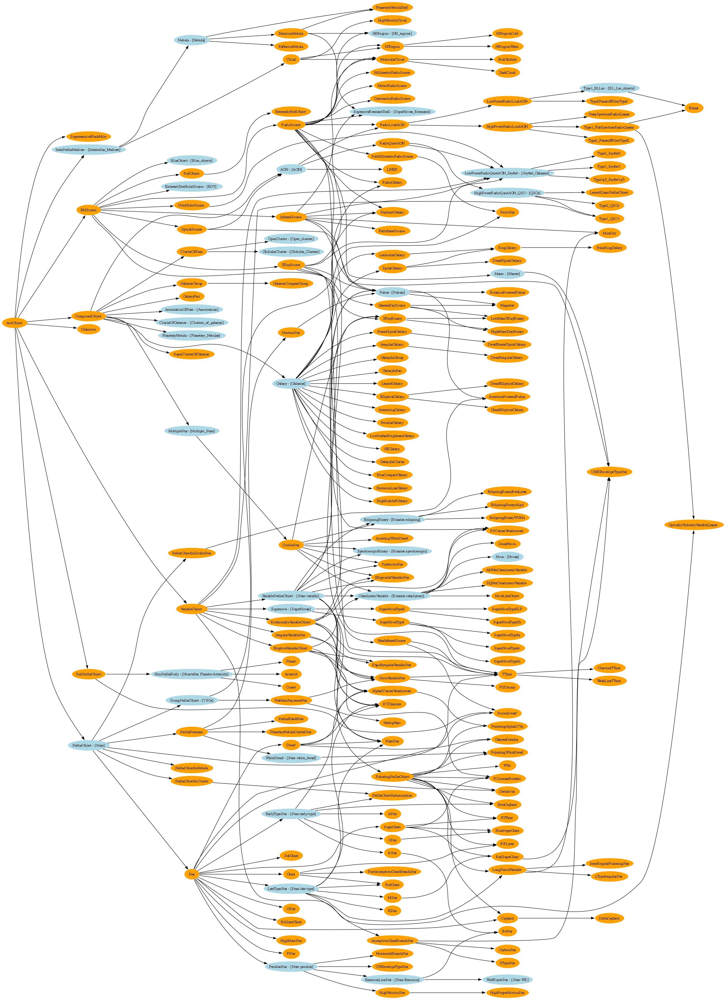

# Ontology of Astronomical Object Types (IVOA)

- **Ontology:** -
- **Model:** [`ivoa.ttl`](ivoa_generated.ttl), [`ivoa.xml`](ivoa.xml)
- **Specification:** https://www.ivoa.net/documents/Notes/AstrObjectOntology/
- **Vocabulary:** -
- **Wiki:** -
- **LOV:** -

---

- [IVOA Semantics Working Group](https://wiki.ivoa.net/twiki/bin/view/IVOA/IvoaSemantics)
- [Ontology of Astronomical Object Types](https://www.ivoa.net/documents/Notes/AstrObjectOntology/)
- [Ontology of Astronomical Object Types Use Cases](https://www.ivoa.net/documents/Notes/AstrObjectOntologyUseCases/)
